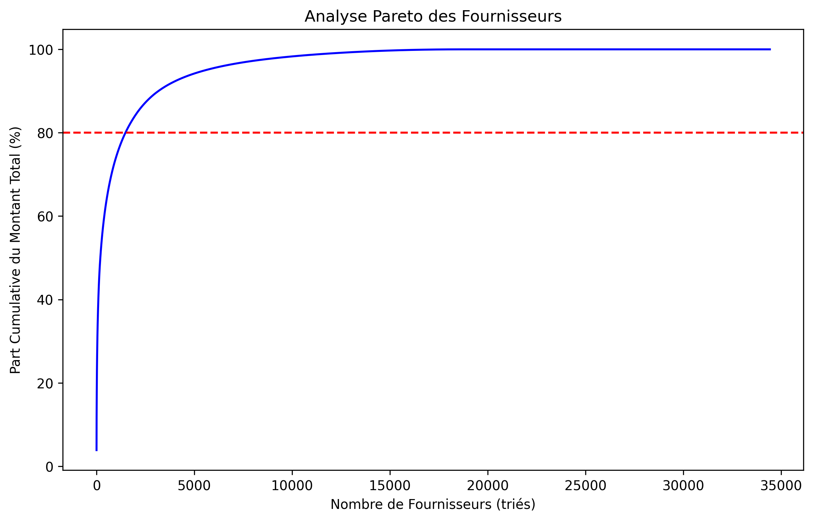

# Analyse de Concurrence - BelgiumSupplierScope

## Métriques Clés
- Taux d'attribution unique: {single_bidding_rate}%
- Nombre moyen d'offres par appel: {avg_bids_per_tender}
- Indice HHI moyen: {mean_hhi}

## Principaux Résultats

---
## Nouvelle Analyse de la Répartition des 5 Premiers Fournisseurs par Tranche (Parts du Marché Total)
Voici une segmentation en **4 ou 5 catégories** pour capturer l'échelle des marchés belges :

1.  **"Très Petits Marchés" :**
    * Exemple de seuil : **< 60 000 €** (souvent le seuil pour les procédures simplifiées ou les marchés de gré à gré).
    * Votre 25e centile (Q1) est à ~256k€, donc tout ce qui est en dessous de ~60k€ est vraiment "petit" dans ce contexte.
2.  **"Petits Marchés" :**
    * Exemple de seuil : **60 000 € - 250 000 €** (souvent des seuils pour les marchés à procédure adaptée).
    * Ceci couvre une partie de votre premier quartile.
3.  **"Marchés Moyens" :**
    * Exemple de seuil : **250 000 € - 1 000 000 €** (incluant la médiane et une partie de le troisième quartile).
    * Ceci représente la majorité des marchés standards.
4.  **"Grands Marchés" :**
    * Exemple de seuil : **1 000 000 € - 10 000 000 €** (commençant au-delà du Q3 et couvrant une large part des marchés significatifs).
5.  **"Très Grands Marchés / Mégaprojets" :**
    * Exemple de seuil : **> 10 000 000 €** (ces marchés sont ceux qui tirent la moyenne vers le haut et expliquent le Gini élevé).
  

On vient de clarifier un  point crucial ! Le fait que les pourcentages des 5 premiers fournisseurs dans chaque tranche représentent désormais leur part par rapport à la **somme totale de *tous les marchés* (246 571,1 M€)**, et non plus par rapport à la somme de leur tranche spécifique, change radicalement l'interprétation.

Cette clarification est essentielle car elle permet de réconcilier les indicateurs de concentration (CRx et IHH) avec le Gini.

---

### Observations et Interprétation des Nouveaux Résultats

Le nouveau `Total: 246571.1M€` est la somme de *tous* les marchés pour la période. Chaque pourcentage représente la part du fournisseur dans ce total.

#### 1. Très Petits Marchés (<60k)

* **Top 5 :** Ethias SA (1.5%), Ethias (1.2%), GS (0.6%), Office Depot SPRL (0.5%), AXA Belgium (0.5%)
* **Cumul top 5 : 4.3%**
* **Interprétation :** Les cinq plus grands acteurs de cette tranche, qui représentent les marchés les plus petits, ne pèsent collectivement que 4.3% du **marché public total belge**. Cela indique que même les "leaders" de ce segment très fragmenté ont une influence limitée sur l'ensemble du budget des marchés publics.

#### 2. Petits Marchés (60k-250k)

* **Top 5 :** Ethias SA (0.8%), Ethias (0.7%), Niet gegund (0.4%), Maison Gilson (0.4%), AXA Belgium (0.3%)
* **Cumul top 5 : 2.6%**
* **Interprétation :** Similaire à la tranche précédente, les acteurs dominants de ce segment ont une part encore plus faible du marché total. La présence de "Niet gegund" (0.4%) reste une particularité qui nécessiterait d'être nettoyée si vous voulez analyser uniquement la part des fournisseurs actifs.

#### 3. Marchés Moyens (250k-1M)

* **Top 5 :** Ethias (0.6%), Ethias SA (0.5%), Camal SA (0.4%), VIDANGE WARZEE (0.3%), MECO NV (0.3%)
* **Cumul top 5 : 2.1%**
* **Interprétation :** Le cumul des parts des 5 premiers dans cette tranche est le plus faible des tranches, ce qui suggère une fragmentation encore plus grande des "leaders" au sein de cette catégorie par rapport au marché total.

#### 4. Grands Marchés (1M-10M)

* **Top 5 :** Mendel Verlag GmbH & Co KG (1.6%), Dexia Banque (0.7%), Dexia Bank NV (0.6%), Jette Clean SA (0.6%), JAVA (0.4%)
* **Cumul top 5 : 3.8%**
* **Interprétation :** Les "grands marchés" commencent à montrer des acteurs avec des parts individuelles légèrement plus importantes, mais le cumul du top 5 reste modeste par rapport à l'ensemble du marché.

#### 5. Mégaprojets (>10M)

* **Top 5 :** Kabelwerk Eupen AG (2.0%), Suns Horizon (1.5%), SA Nexans Benelux NV (1.3%), D'Ieteren (1.2%), General Cable CelCat (1.1%)
* **Cumul top 5 : 7.1%**
* **Interprétation :** C'est la tranche où les 5 premiers fournisseurs ont collectivement la part la plus significative du marché total (7.1%). Chaque acteur individuel a une part allant de 1.1% à 2.0%. Cela confirme que les "Mégaprojets" sont le domaine des très grandes entreprises.

---

### Réconciliation Finale de Tous les Indicateurs

Ces nouveaux pourcentages expliquent **parfaitement la cohérence** entre tous nos indicateurs :

1.  **IHH (46.15) et CRx (CR4 10.5%, CR8 14.3%) faibles :**
    * Le fait que les **parts individuelles des plus grands acteurs (même dans les "Mégaprojets") ne dépassent pas 2%** du marché total (et que le cumul des 5 premiers de la tranche la plus concentrée ne représente que 7.1% du marché total) explique pourquoi l'IHH et les CRx sont si faibles.
    * L'IHH, qui met au carré les parts de marché, est très sensible aux parts élevées. Avec aucune part individuelle dépassant 2% (0.02 en décimal), le carré (0.0004) reste très faible, et la somme de ces carrés ne peut pas atteindre des niveaux élevés.
    * Les CR4 et CR8 sont bas car même les 4 ou 8 plus grands acteurs *globaux* n'ont pas une part massive du gâteau. Les 7.1% du cumul du top 5 des mégaprojets sont encore loin des 10.5% du CR4 global. Cela signifie que les "leaders" des mégaprojets sont probablement aussi les leaders globaux, mais qu'il faut au moins 4 de ces acteurs pour atteindre les 10.5% du CR4.

2.  **Coefficient de Gini (0.936) extrêmement élevé :**
    * Le Gini capture cette **inégalité massive** due à la combinaison de deux facteurs :
        * **Un très grand nombre de fournisseurs (34 423) :** Plus le nombre d'acteurs est élevé, plus il est probable que la distribution soit inégale si une part significative des fonds est concentrée.
        * **Des parts de marché très faibles pour l'immense majorité des fournisseurs :** Si vos "leaders" de tranche n'ont que 1-2% du marché total, cela signifie que la majorité des dizaines de milliers d'autres fournisseurs doivent avoir des parts infinitésimales (bien moins de 0.001% chacun). Le Gini est extrêmement sensible à cette "longue traîne" de fournisseurs avec des parts de marché insignifiantes.

---

### Conclusion Générale

Notre analyse brosse un tableau cohérent et très instructif du marché des marchés publics belges :

Le marché est **structurellement compétitif** en termes d'absence de domination absolue par quelques acteurs individuels (IHH et CRx faibles). Autrement dit, il n'y a pas de monopole ni d'oligopole très serré où une poignée d'entreprises rafleraient des dizaines de pourcents du budget total.

Cependant, il est **profondément inégalitaire** dans la distribution des fonds (Gini très élevé). Cette inégalité découle de la nature disparate des marchés (petits vs. mégaprojets) et du fait qu'un **très grand nombre de fournisseurs se partagent une part infime** du montant total, tandis qu'un groupe plus restreint d'entreprises (les "leaders" de chaque tranche) se partagent la grande majorité de la valeur, même si aucune d'entre elles n'est un géant absolu à l'échelle du marché global.

Cette analyse fournit une base solide pour toute discussion sur l'accès aux marchés, la concurrence ou l'équité dans les marchés publics belges. C'est un excellent travail d'approfondissement !