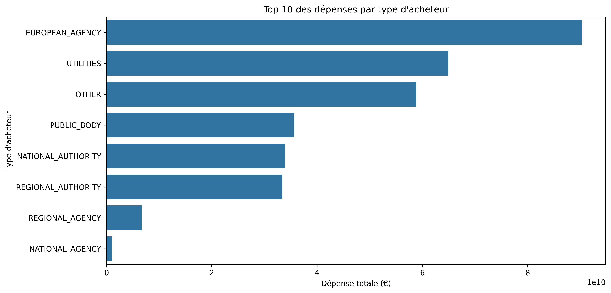

# Synthèse des résultats

# Analyse des dépenses par type d'acheteur

## Résultats principaux

### Dépenses par type d'acheteur
```python
print(buyer_metrics['by_buyertype'].head(5))
```

### Dépenses par activité principale
```python
print(buyer_metrics['by_activity'].head(5))
```

## Visualisations

