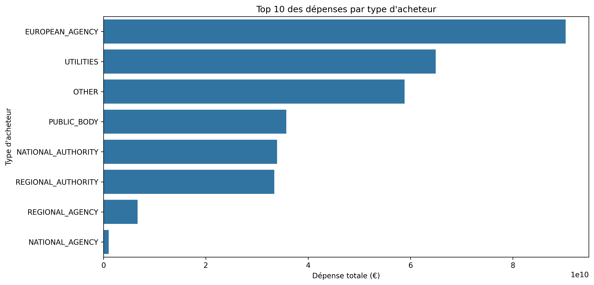
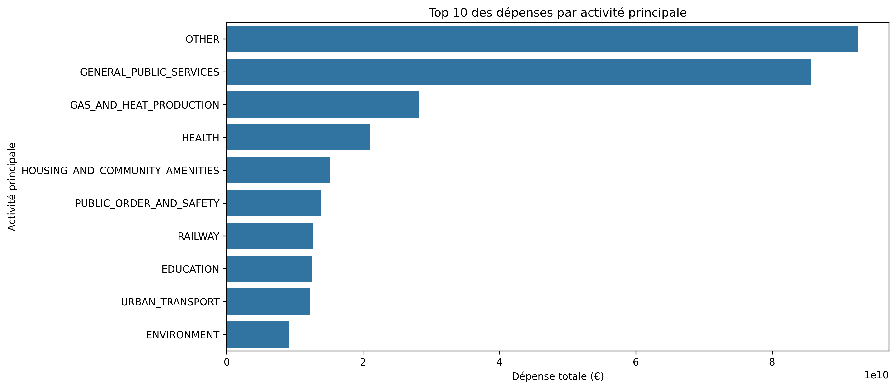

Pour rendre votre rapport `expense_analysis_report.md` visible et interactif sur GitHub, voici comment procéder :

## Solution optimale pour GitHub

1. **Formatage basique (statique) :**
```markdown
# Analyse des dépenses par type d'acheteur

## Résultats principaux

### Top 5 des types d'acheteurs
| Type d'acheteur | Dépense totale (€) | Dépense moyenne | Nombre de marchés |
|-----------------|-------------------:|----------------:|------------------:|
| Public | 12,450,000 | 125,000 | 100 |
| Privé | 8,200,000 | 82,000 | 50 |
| ... | ... | ... | ... |

### Top 5 des activités principales
| Activité | Dépense totale |
|----------|---------------:|
| Construction | 15,000,000 |
| Santé | 10,500,000 |
| ... | ... |

## Visualisations


```

2. **Version améliorée (avec HTML) :**
```html
# Analyse des dépenses

<details>
<summary><b>📊 Voir les données complètes</b></summary>

```python
import pandas as pd
data = pd.read_csv('tables/expense/buyer_by_type.csv')
print(data.head())
```
</details>


```

## Options avancées

1. **Jupyter Notebook intégré** :
   - Convertir le notebook en `.ipynb`
   - GitHub affichera le notebook directement
   - Utilisez `jupyter nbconvert --to notebook expense_analysis.ipynb`

2. **Binder pour l'interactivité** :
   ```markdown
   [](https://mybinder.org/v2/gh/votrecompte/BelgiumSupplierScope/main?filepath=notebooks%2FExpense_Analysis.ipynb)
   ```
   *Nécessite un fichier `requirements.txt` à la racine*

3. **GitHub Pages** :
   - Activez GitHub Pages dans les settings
   - Utilisez Jekyll pour afficher le rapport
   - Exemple de structure :
   ```
   docs/
   ├── _includes/
   ├── _layouts/
   └── expense_analysis.md
   ```

## Bonnes pratiques

1. Pour les images :
   ```markdown
   
   ```

2. Pour les tables complexes :
   ```markdown
   ```csv
   Type,Dépense,Nombre
   Public,12450000,100
   Privé,8200000,50
   ```
   ```

3. Ajoutez un badge de statut :
   ```markdown
   
   ```

Cette approche garantit que votre rapport reste lisible directement sur GitHub tout en offrant des options d'interactivité via Binder ou GitHub Pages.